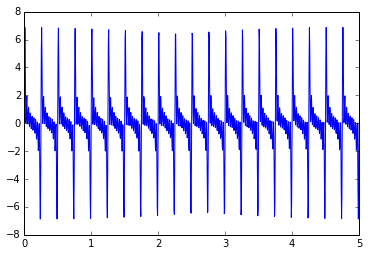
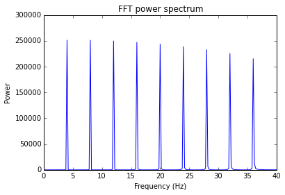

# Dynamic Mode Decomposition (DMD) and Multi-Resolution
Decoding hand movements from ECoG recordings

##Installation
```Bash
git clone https://github.com/BruntonUWBio/ecog-hand
sudo apt-get install python3-pip
sudo pip3 install numpy matplotlib cvxpy pytest sklearn
```
##Usage

In your project, load the required modules:


```python
%matplotlib inline
%load_ext autoreload
%autoreload 2
from mrDMD import mrDMD
from DMD import DMD
from helperFunctions import *
```

Start with a signal composed of a sum of sinusoids in 1-dimension


```python
dt = .001
N = 5000
t = np.linspace(0, 10, N)
amp = 1
freq_max = 40
freqs = np.arange(freq_max)
freqs = freqs[::2]
print('Freqs: ')
print(freqs)

X = buildX(freqs, t)
plt.figure()
plt.plot(t, X[0,:])
plt.show()
```

    Freqs: 
    [ 0  2  4  6  8 10 12 14 16 18 20 22 24 26 28 30 32 34 36 38]





Comparisons to FFT when frequency well below Nyquist


```python
freq, P = fftPlot(X, dt, freq_max)
```





```python
stack_factor = 2*len(freqs)
kwargs = {'dt':dt, 
    'scale_modes':True}
dmd = DMD(**kwargs)
dmd.fit(X)
f, P = dmd.spectrum(sort=True)
plt.figure()
plt.stem(f, P)
plt.title('DMD spectrum')
plt.xlabel('Frequency')
plt.show()
plt.close()

idx = inRange(f, (1,freq_max))
plt.figure()
plt.stem(f[idx], P[idx])
plt.title('DMD spectrum shortened')
plt.xlabel('Frequency')
plt.show()
plt.close()
```


    ---------------------------------------------------------------------------

    MemoryError                               Traceback (most recent call last)

    <ipython-input-5-cb629b3242fa> in <module>()
          3     'scale_modes':True}
          4 dmd = DMD(**kwargs)
    ----> 5 dmd.fit(X)
          6 f, P = dmd.spectrum(sort=True)
          7 plt.figure()


    /home/kdmarrett/git/ecog-hand/DMD.py in fit(self, Xraw)
        232             Returns the instance of itself
        233         """
    --> 234         self._fit(Xraw)
        235         return self
        236 


    /home/kdmarrett/git/ecog-hand/DMD.py in _fit(self, Xraw)
        274             #below: theoretic. equivalent but impossible in python:
        275             #Ahat = (S_r^(-1/2)).dot(Atilde).dot(S_r^(1/2))
    --> 276             lambdas, What = LA.eig(Ahat)
        277             W = S_r_pow.dot(What)
        278         else:


    /usr/local/lib/python3.5/dist-packages/numpy/linalg/linalg.py in eig(a)
       1126         _raise_linalgerror_eigenvalues_nonconvergence)
       1127     signature = 'D->DD' if isComplexType(t) else 'd->DD'
    -> 1128     w, vt = _umath_linalg.eig(a, signature=signature, extobj=extobj)
       1129 
       1130     if not isComplexType(t) and all(w.imag == 0.0):


    MemoryError: 


## Testing

Pytest is used for testing run the following at the command line

```Bash
pytest
```
